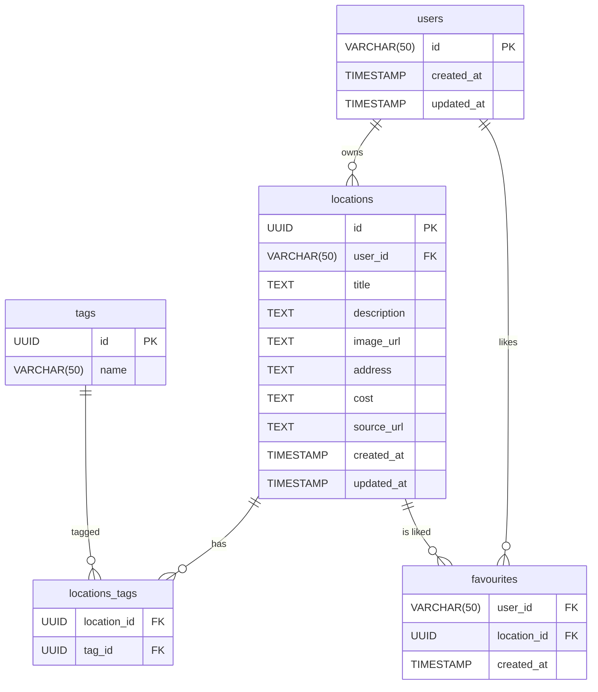

# Архитектура данных (Data Model) — **Batumi Trip**
> **Назначение:** Документ описывает логическую модель данных SPA‑приложения «Batumi Trip», включая ER‑диаграмму, схемы таблиц, индексы, миграции Supabase (PostgreSQL) и правила Row‑Level Security (RLS). Модель учитывает password‑less аутентификацию, открытый `SELECT` для всех локаций и приватные операции по владельцу.

---
## 1. ER‑диаграмма



---

## 2. Описание таблиц

### 2.1 `users`

| Поле | Тип | Ключи/DEFAULT | Описание |
|------|-----|---------------|----------|
| `id` | `VARCHAR(50)` | **PK** | Уникальный логин — идентификатор пользователя. |
| `created_at` | `TIMESTAMP WITH TIME ZONE` | `DEFAULT now()` | |
| `updated_at` | `TIMESTAMP WITH TIME ZONE` | `DEFAULT now()` + триггер | |

### 2.2 `locations`

| Поле | Тип | Ключи/DEFAULT | Описание |
|------|-----|---------------|----------|
| `id` | `UUID` | **PK**, `DEFAULT gen_random_uuid()` | |
| `user_id` | `VARCHAR(50)` | **FK → users.id** | Владелец записи. |
| `title` | `TEXT` | `NOT NULL` | Название локации. |
| `description` | `TEXT` | | Подробное описание. |
| `image_url` | `TEXT` | | Ссылка на изображение. |
| `address` | `TEXT` | | Адрес / координаты. |
| `cost` | `TEXT` | | Стоимость или категория. |
| `source_url` | `TEXT` | | Ссылка на первоисточник. |
| `created_at` | `TIMESTAMP WITH TIME ZONE` | `DEFAULT now()` | |
| `updated_at` | `TIMESTAMP WITH TIME ZONE` | `DEFAULT now()` + триггер | |

### 2.3 `tags`

| Поле | Тип | Ключи/DEFAULT | Описание |
|------|-----|---------------|----------|
| `id` | `UUID` | **PK**, `DEFAULT gen_random_uuid()` | |
| `name` | `VARCHAR(50)` | `UNIQUE`, `NOT NULL` | Название тега. |

### 2.4 `locations_tags`

| Поле | Тип | Ключи/DEFAULT | Описание |
|------|-----|---------------|----------|
| `location_id` | `UUID` | **PK (часть)**, **FK → locations.id** | Ссылка на локацию. |
| `tag_id` | `UUID` | **PK (часть)**, **FK → tags.id** | Ссылка на тег. |

### 2.5 `favourites`

| Поле | Тип | Ключи/DEFAULT | Описание |
|------|-----|---------------|----------|
| `user_id` | `VARCHAR(50)` | **PK (часть)**, **FK → users.id** | Пользователь, который добавил в избранное. |
| `location_id` | `UUID` | **PK (часть)**, **FK → locations.id** | Избранная локация. |
| `created_at` | `TIMESTAMP WITH TIME ZONE` | `DEFAULT now()` | Дата добавления в избранное. |

---
## 3. Индексы и оптимизация

| Таблица | Индекс | Роль |
|---------|--------|------|
| `locations` | `idx_locations_user` (`user_id`) | Быстрый выбор локаций владельца. |
| `locations` | `idx_locations_title_trgm` `USING GIN(title gin_trgm_ops)` | Поиск по названию. |
| `locations_tags` | `idx_locations_tags_tag` (`tag_id`) | Фильтрация по тегу. |
| `favourites` | `idx_favourites_user` (`user_id`) | Список избранных пользователя. |
| `favourites` | `idx_favourites_location` (`location_id`) | Подсчёт лайков у локации. |
| `tags` | `UNIQUE (name)` | Исключить дубликаты. |

---
## 4. Миграции (SQL)

```sql
-- 4.1 Расширения
create extension if not exists "pgcrypto";
create extension if not exists "pg_trgm";

-- 4.2 Функция обновления updated_at
create or replace function public.trigger_set_timestamp()
returns trigger as $$
begin
  new.updated_at := now();
  return new;
end;
$$ language plpgsql;

-- 4.3 users
create table if not exists public.users (
  id          varchar(50) primary key,
  created_at  timestamptz default now(),
  updated_at  timestamptz default now()
);
create trigger set_timestamp_users
  before update on public.users
  for each row execute procedure public.trigger_set_timestamp();

-- 4.4 locations
create table if not exists public.locations (
  id          uuid primary key default gen_random_uuid(),
  user_id     varchar(50) references public.users(id) on delete cascade,
  title       text not null,
  description text,
  image_url   text,
  address     text,
  cost        text,
  source_url  text,
  created_at  timestamptz default now(),
  updated_at  timestamptz default now()
);
create trigger set_timestamp_locations
  before update on public.locations
  for each row execute procedure public.trigger_set_timestamp();

-- 4.5 tags
create table if not exists public.tags (
  id   uuid primary key default gen_random_uuid(),
  name varchar(50) not null unique
);

-- 4.6 locations_tags
create table if not exists public.locations_tags (
  location_id uuid references public.locations(id) on delete cascade,
  tag_id      uuid references public.tags(id) on delete cascade,
  primary key (location_id, tag_id)
);

-- 4.7 favourites
create table if not exists public.favourites (
  user_id     varchar(50) references public.users(id) on delete cascade,
  location_id uuid references public.locations(id) on delete cascade,
  created_at  timestamptz default now(),
  primary key (user_id, location_id)
);

-- 4.8 Индексы
create index if not exists idx_locations_user on public.locations(user_id);
create index if not exists idx_locations_title_trgm on public.locations using gin (title gin_trgm_ops);
create index if not exists idx_locations_tags_tag on public.locations_tags(tag_id);
create index if not exists idx_favourites_user on public.favourites(user_id);
create index if not exists idx_favourites_location on public.favourites(location_id);
```

---
## 5. Политики RLS

```sql
-- 5. Политики RLS (исправлено приведение типов)

-- USERS
alter table public.users      enable row level security;

create policy "Users: everyone select"
  on public.users for select using (true);
create policy "Users: self insert"
  on public.users for insert with check (auth.uid()::text = id);
create policy "Users: self update"
  on public.users for update
    using (auth.uid()::text = id)
    with check (auth.uid()::text = id);
create policy "Users: self delete"
  on public.users for delete using (auth.uid()::text = id);

-- LOCATIONS
alter table public.locations  enable row level security;

create policy "Locations: everyone select"
  on public.locations for select using (true);
create policy "Locations: owner insert"
  on public.locations for insert with check (auth.uid()::text = user_id);
create policy "Locations: owner update"
  on public.locations for update
    using (auth.uid()::text = user_id)
    with check (auth.uid()::text = user_id);
create policy "Locations: owner delete"
  on public.locations for delete using (auth.uid()::text = user_id);

-- TAGS
alter table public.tags       enable row level security;

create policy "Tags: everyone select"
  on public.tags for select using (true);
create policy "Tags: any insert"
  on public.tags for insert with check (true);

-- LOCATIONS_TAGS
alter table public.locations_tags enable row level security;

create policy "LT: everyone select"
  on public.locations_tags for select using (true);
create policy "LT: owner insert"
  on public.locations_tags for insert with check (
    (select user_id from public.locations where id = location_id)::text = auth.uid()::text
  );
create policy "LT: owner delete"
  on public.locations_tags for delete using (
    (select user_id from public.locations where id = location_id)::text = auth.uid()::text
  );

-- FAVOURITES
alter table public.favourites enable row level security;

create policy "Fav: owner select"
  on public.favourites for select using (auth.uid()::text = user_id);
create policy "Fav: owner insert"
  on public.favourites for insert with check (auth.uid()::text = user_id);
create policy "Fav: owner delete"
  on public.favourites for delete using (auth.uid()::text = user_id);
```

---
## Примечания к реализации
* **Аутентификация:** NextAuth JWT, совпадение `auth.uid()` и `users.id`.
* **Избранное:** фронтенд проверяет `isFavourite` через таблицу `favourites`.
* **Удаление пользователя:** каскадом удаляются его локации и избранное.
