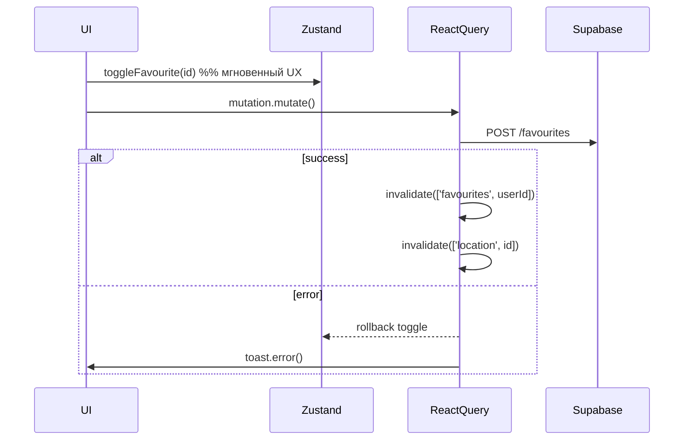

## StateManagement‑BatumiTrip.md

### Слои состояния приложения
| Слой                      | Инструмент              | Что хранит                                                                                                   | Где используется                                               |
| ------------------------- | ----------------------- | ------------------------------------------------------------------------------------------------------------ | -------------------------------------------------------------- |
| **Server cache**          | **React Query**         |  Все данные, приходящие из Supabase (списки, карточки, теги, избранное)                                      | хуки `useLocations`, `useOneLocation`, `useTags`, мутации CRUD |
| **UI‑store**              | **Zustand (+ persist)** | Чисто клиентские флаги интерфейса `searchQuery`, `selectedTags`, `showLoginModal`, `favourites {id:boolean}` | SearchBar, TagBadge, LoginModal, Favourite UI                  |
| **Cross‑cutting context** | **Context API**         | Session (`AuthProvider → SessionProvider`), тема (`ThemeProvider → next‑themes`), QueryClient                | обёртка `Providers` вокруг всего приложения                    |
| **Local state**           |  `useState/useReducer`  | мгновенные UI‑детали (раскрыт поисковой бар, режим Edit карточки и т.п.)                                     | Header, LocationDetailPage                                     |

---
## React Query

### Базовая конфигурация
`createQueryClient()` задаёт единые правила кеша 

```js
queries: {
  staleTime: 60 000,      // данные считаются свежими 1 мин
  gcTime:   1 800 000,    // хранятся в памяти до 30 мин
  refetchOnWindowFocus: false,
  retry: 1,
},
mutations: { networkMode: 'always' }
```
Devtools подключаются только в `development` среде через компонент `Providers` 

### Ключи и соглашения
| Тип данных                                                                  | Ключ                                 | Пример вызова                         |
| --------------------------------------------------------------------------- | ------------------------------------ | ------------------------------------- |
| Коллекция                                                                   | `['locations']`                      | `useInfiniteQuery` (страница списка)  |
| Одна сущность                                                               | `['location', id]`                   | `useOneLocation(id)`                  |
| Фильтрованные под‑ресурсы                                                   | `['favourites', userId]`, `['tags']` | `FavouriteFetcher`, `useTags`         |
| *Паттерн:* множественное число — список, единственное + id — одно значение. |                                      |                                       |

### Кеширование
* Порция списка = **9** элементов (константа `PAGE_SIZE`) .
* Бесконечная прокрутка строится на курсоре `created_at` ↓.
* Для детальной страницы `staleTime` повторно задан в хук ‑ 60 с  .

### Оптимистичные мутации (паттерн)
1. **onMutate** – локальное обновление (часто через Zustand) и `cancelQueries`.
2. **onError** – откат и toast с ошибкой.
3. **onSuccess / onSettled** – `invalidateQueries` нужных ключей.
   Пример – избранное (`useToggleFavourite`) :
```text
toggleFavouriteLocal();          // 1 — мгновенно меняем UI
onError ➜ rollback + toast       // 2
onSuccess ➜ invalidate fav/loc   // 3
```
### Интеграция с Supabase

* **Запросы** — REST‑фильтры или RPC‑функции внутри `queryFn`.
  * список: `supabase.from('locations').select(...)` 
  * деталь: join + left join favourites 
* **Мутации** — RPC‑процедуры (`create_location_with_tags`, `update_location_with_tags`, `delete_location`) или прямой `insert/delete` в таблицу.
  * добавление локации → `useAddLocation` 
  * удаление → `useDeleteLocation` 

---
## Zustand

### Структура стора (uiStore.js) 
```ts
{
  searchQuery: string
  selectedTags: string[]
  showLoginModal: boolean
  favourites: Record<id, boolean>

  /* actions */
  setSearchQuery(q)
  toggleTag(tag)
  setLoginModal(bool)
  toggleFavourite(id)
  hydrateFavourites(ids[])   // загрузка с сервера
}
```
Store пишется в `localStorage` (`persist` middleware, ключ `batumi-ui`, сохраняются только `favourites`).

### Связывание с React Query
* **FavouriteFetcher** читает авторизованного пользователя, вытягивает `favourites` из Supabase и вызывает `hydrateFavourites`, а при logout очищает и инвалиды кеш .
* `useToggleFavourite` меняет Zustand синхронно ещё до запроса .

### Синхронизация с Supabase
Загрузка и выгрузка избранного, а также фильтрация по тегам (`useLocations`) используют сторадж‑данные из Zustand, но итоговый источник истины всегда Supabase (кеш пере‑инвалидация после подтверждения сервером).

---
## Context API
| Контекст               | Поставщик                                   | Что даёт                                              |
| ---------------------- | ------------------------------------------- | ----------------------------------------------------- |
| **AuthContext**        | `AuthProvider` ➜ NextAuth `SessionProvider` | `useAuth()` – `{ user, isLoading, signIn, signOut }`  |
| **ThemeContext**       | `ThemeProvider` ➜ `next-themes`             | текущая цветовая тема                                 |
| **QueryClientContext** | `QueryClientProvider`                       | общий экземпляр QueryClient                           |

---
## Пользовательские хуки (core)
| Хук                  | Тип                | Ключ                     | Особенности                                                                                        |
| -------------------- | ------------------ | ------------------------ | -------------------------------------------------------------------------------------------------- |
| `useLocations`       | `useInfiniteQuery` | `['locations']`          | фильтры search+tags, курсор‑пагинация 9×                                                           |
| `useOneLocation(id)` | `useQuery`         | `['location', id]`       | join tags,favourites, `staleTime:60 с`                                                             |
| `useTags`            | `useQuery`         | `['tags']`               | список тегов, используется в SearchBar / ChooseTag                                                 |
| `useAddLocation`     | `useMutation`      |  –                       | загрузка файла в Storage + RPC create, invalidates `locations`, `tags`, success toast              |
| `useUpdateLocation`  | `useMutation`      |  –                       | аналогично, но RPC `update_location_with_tags`                                                     |
| `useDeleteLocation`  | `useMutation`      |  –                       | RPC delete\_location + storage cleanup, invalidates `locations/favourites`, rollback fav in store  |
| `useToggleFavourite` | `useMutation`      | `['favourites', userId]` | подробный optimistic‑flow                                                                          |
| `useAuth`            | wrapper            | –                        |  тонкая оболочка над NextAuth `useSession`                                                         |

---
## Поток оптимистичного обновления (пример ⭐ «Избранное»)

Похожий сценарий применяется в `useAddLocation` (добавление карточки) и `useDeleteLocation` (каскадное удаление).

---
## Обработка ошибок и глобальные **toasts**
* В каждом хукe callback `onError` вызывает `toast.error(message)` из **react‑hot‑toast**  .
* `onSuccess` и важные positive‑case события выводят `toast.success`.
* Для Fatal auth‑ошибки в `useToggleFavourite` открывается `LoginModal` вместо toast .
* Компонент‑обёртка Toaster располагается на уровне `_app` (в проекте уже присутствует, не входит в данный документ).

---