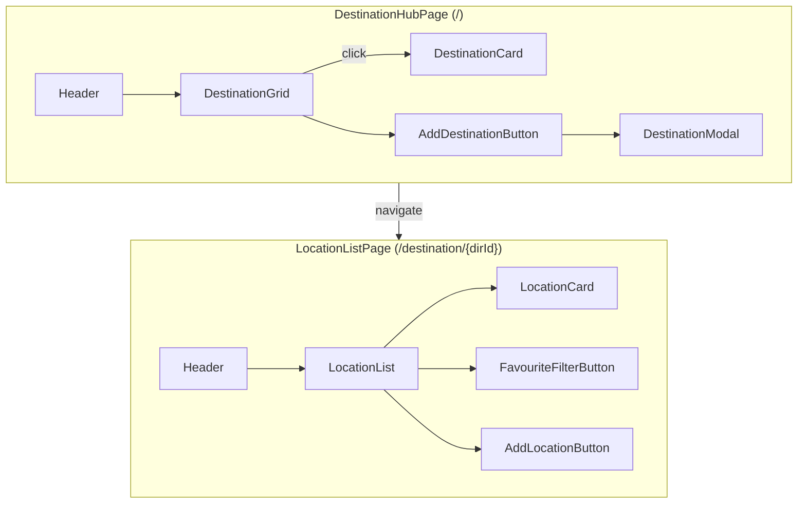
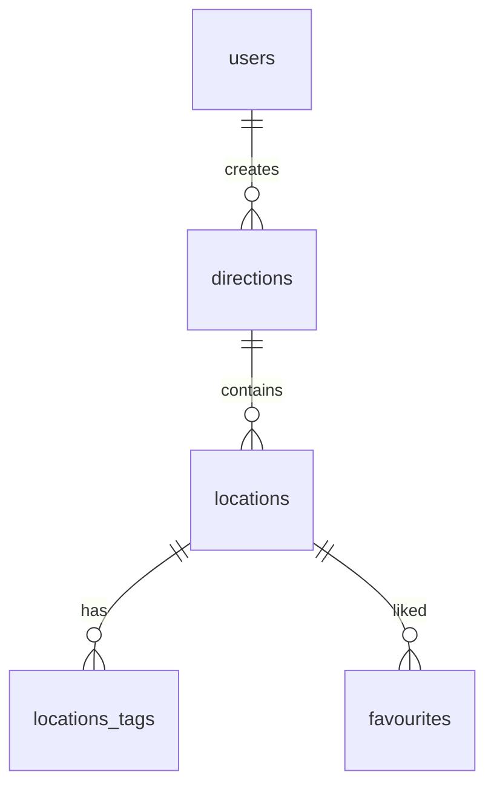

# NewMainPageFeature — Верхнеуровневая архитектура

> **Кодовое имя**: *Destination Branches*
> **Цель**: Расширить Batumi Trip до мульти‑направлений, не ломая текущую логику «локаций».

---
## 1. Резюме
Batumi Trip не должен ограничивается Батуми. Пользователь управляет **направлениями (Direction)** — самостоятельными «ветками» (страна / город / регион), каждая со своими локациями, тегами и избранным. Новая **главная страница‑хаб** (`/`) показывает сетку направлений. Переход в `/destination/{dirId}` подгружает существующий `LocationListPage`, но с фильтром `direction_id`.

---
## 2. Область изменений
| Слой               | Что меняется                                                                        | Как интегрируется                                                                                                           |
| ------------------ | ----------------------------------------------------------------------------------- | --------------------------------------------------------------------------------------------------------------------------- |
| **UI / Pages**     | `DestinationHubPage`, `DestinationCard`, `DestinationModal`, `AddDestinationButton` | Расположение в **RootLayout** после `Header`; классы Tailwind и shadcn/ui строго по StyleGuide‑BatumiTrip citeturn0file1 |
| **Hooks**          | `useDirections`, `useAddDirection`, `useUpdateDirection`, `useDeleteDirection`      | Реализуются в `/hooks`, повторяя сигнатуру существующих CRUD‑хуков (см. `useAddLocation`) citeturn0file0                 |
| **Zustand**        | `activeDirectionId`, `setActiveDirection`                                           | Добавляется в `uiStore.js`, не требует миграции localStorage (persist → partialize)                                         |
| **Supabase**       | Таблица `directions` + RPC (add / update / delete)                                  | Миграция SQL, индекс `locations(direction_id, created_at)`                                                                  |
| **Routing**        | Новые префиксы `/destination/[dirId]/*`                                             | Статический сегмент `destination` исключает конфликт с существующими страницами                                             |
| **Existing hooks** | `useLocations()`                                                                    | Принимает `directionId` и добавляет `.eq('direction_id', id)`                                                               |

---
## 3. Компонентная схема (Mermaid)


> *Все существующие компоненты из `ExistComponents.md` сохраняют интерфейс; мы лишь оборачиваем их новым роутом.*

---
## 4. Потоки данных
1. **Hydration**
   2. `FavouriteFetcher` и `TagsPrefetcher` остаются в `RootLayout`.
   3. При навигации `router.push('/destination/{id}')` вызывается `setActiveDirection(id)`.
4. **List Fetch** (`useLocations`)
   ```ts
   useInfiniteQuery(['locations', { dir: activeDirectionId, search, tags }], ...)
   ```
5. **Mutation каскада**
   * Удаление направления ➔ RPC `delete_direction` ➔ триггер React‑Query `invalidateQueries(['directions'])` + `invalidateQueries(['locations'])`.
1. **Оптимистичность**
   * Следуем паттернам `useToggleFavourite`: все CRUD‑хуки для directions реализуют `onMutate → rollback → invalidate`.

---
## 5. API‑контур (кратко)
| Хук                    | HTTP / RPC                                 | Кэш                                     | Особенности                      |
| ---------------------- | ------------------------------------------ | --------------------------------------- | -------------------------------- |
| `useDirections()`      | `GET /rest/v1/directions?user_id=eq.{uid}` | `['directions']`                        | `staleTime = 60 000`             |
| `useAddDirection()`    | `rpc('add_direction', {...})`              | `invalidate ['directions']`             | Обложка через `uploadImage()`    |
| `useUpdateDirection()` | `rpc('update_direction', {...})`           | `invalidate ['directions']`             | Замену cover — с `deleteImage()` |
| `useDeleteDirection()` | `rpc('delete_direction')`                  | `invalidate ['directions','locations']` | Cascade & optimistic             |

Полные спецификации будут вынесены в отдельный **API.md**.

---
## 6. Состояние (Zustand)
```ts
interface UIStore {
  activeDirectionId: string | null;
  setActiveDirection: (id: string|null) => void;
}
```
* **Гидратация**: `DestinationHubPage` ➔ `setActiveDirection(null)`.
* **Middleware persist**: поле *не* сохраняется в LS, чтобы не портить deep‑links.

---
## 7. База данных / Supabase


*Миграции находятся в `supabase/migrations/20250515_directions.sql`.*
| Сущность       | Ключевые поля                                                                  | Примечание                                           |
| -------------- | ------------------------------------------------------------------------------ | ---------------------------------------------------- |
| **directions** | `id UUID PK`, `user_id FK → users.id`, `title`, `country`, `city`, `cover_url` | RLS **не** включён, проверка прав внутри RPC функций |

**Индексы**
```sql
CREATE INDEX locations_direction_created_at_idx
  ON locations(direction_id, created_at DESC);
```

---
## 8. Точки изменения существующего кода
| Файл              | Изменение                                                                                                                      |
| ----------------- | ------------------------------------------------------------------------------------------------------------------------------ |
| `app/page.js`     | Заменить на `DestinationHubPage` (новый компонент). Старый `LocationListPage` переезжает в `app/destination/[dirId]/page.jsx`. |
| `uiStore.js`      | Добавить `activeDirectionId` + action.                                                                                         |
| `useLocations.js` | Доп. аргумент `directionId`; React‑Query `queryKey` расширяется.                                                               |
| `Header`          | Логотип ведёт на `/` (хаб). Остальное без изменений.                                                                           |

---
## 9. Надёжность и безопасность
* RPC‑процедуры проверяют `p_user_id` ≡ `auth.uid()` (хотя RLS off).
* Удаление направления запрашивает двойное подтверждение с подсчётом каскадных локаций через `SELECT count(*)`.
* Индексация `direction_id` гарантирует, что существующие InfiniteScroll‑запросы не теряют производительность.

---
## 10. План интеграции (high‑level)
1. **DB migration** (фича‑флаг OFF).
2. **Hooks** + unit‑tests.
3. **Zustand update**.
4. **Routing & Pages** (Hub → Branch).
5. **UI components** (cards, modal) — Atomic / storybook.
6. **E2E smoke** (Cypress: create → list → delete direction).
7. **Gradual rollout**: фича‑флаг «multi‑destination» per‑user.
