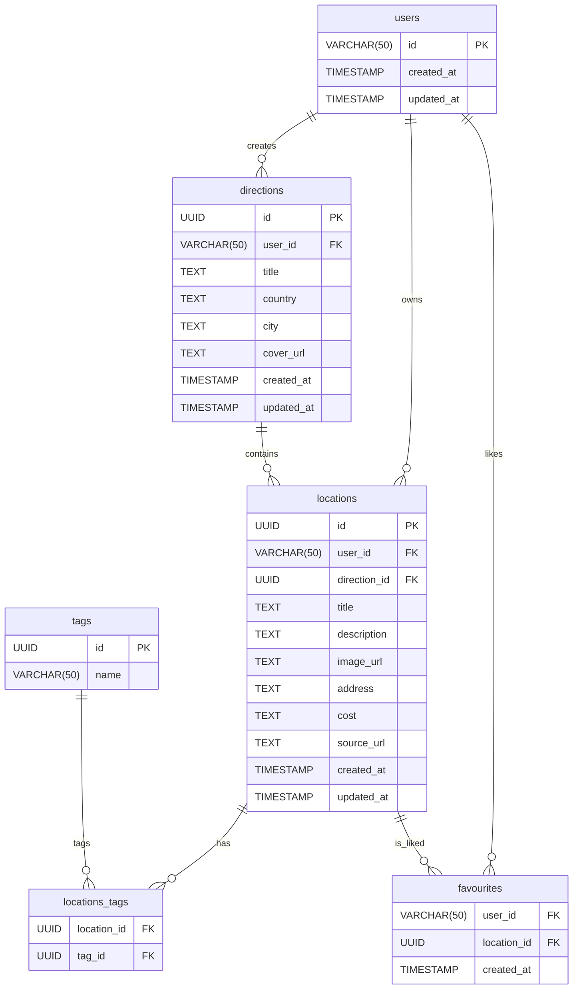

# DataModel‑NewMainPage

> **Контекст**: новый хаб направлений (*Destination Branches*) расширяет существующую модель Batumi Trip. Ниже приведены согласованные сущности, связи и миграции для Supabase‑Postgres, полностью совместимые с `ExistComponents.md` и `Architecture‑NewMainPage.md`.

---

## 1. ER‑диаграмма



---

## 2. Таблицы и связи

| Таблица             | Ключевые поля                            | Связи / Ограничения                                                           |
| ------------------- | ---------------------------------------- | ----------------------------------------------------------------------------- |
| **users**           | `id` PK                                  | Базовая таблица аутентификации (создаётся NextAuth).                          |
| **directions**      | `id` PK, `user_id` FK → `users.id`       | `ON DELETE CASCADE` (удаление пользователя ведёт к удалению его направлений). |
| **locations**       | `id` PK, `user_id` FK, `direction_id` FK | `user_id → users.id`, `direction_id → directions.id ON DELETE CASCADE`.       |
| **tags**            | `id` PK                                  | Уникальный `name`.                                                            |
| **locations\_tags** | `location_id` FK, `tag_id` FK            | Составной `PRIMARY KEY (location_id, tag_id)`. Каскад `ON DELETE CASCADE`.    |
| **favourites**      | `user_id` FK, `location_id` FK           | Составной `PRIMARY KEY (user_id, location_id)`. Каскад `ON DELETE CASCADE`.   |

> **Каскад**: при удалении `direction` автоматом удаляются связанные `locations`, а триггеры БД чистят стыковочные таблицы (`locations_tags`, `favourites`). RPC‑функция `delete_direction` дополнительно удаляет локации явным запросом — это дублирующая «страховка».

---

## 3. RLS

Политики строковой безопасности **отключены** — контроль прав возложен на RPC‑процедуры.

```sql
ALTER TABLE directions      DISABLE ROW LEVEL SECURITY;
ALTER TABLE locations       DISABLE ROW LEVEL SECURITY;
ALTER TABLE locations_tags  DISABLE ROW LEVEL SECURITY;
ALTER TABLE favourites      DISABLE ROW LEVEL SECURITY;
```

---

## 4. Индексы

```sql
-- Ускоряет бесконечную прокрутку LocationListPage
CREATE INDEX IF NOT EXISTS locations_direction_created_at_idx
  ON locations (direction_id, created_at DESC);
```

---

## 5. Миграции (DDL)

```sql
-- 20250515_directions.sql
CREATE EXTENSION IF NOT EXISTS "pgcrypto";

-- 1. directions
CREATE TABLE IF NOT EXISTS directions (
  id         UUID PRIMARY KEY DEFAULT gen_random_uuid(),
  user_id    VARCHAR(50) NOT NULL REFERENCES users(id) ON DELETE CASCADE,
  title      TEXT NOT NULL,
  country    TEXT NOT NULL,
  city       TEXT,
  cover_url  TEXT,
  created_at TIMESTAMP WITH TIME ZONE DEFAULT now(),
  updated_at TIMESTAMP WITH TIME ZONE DEFAULT now()
);

-- 2. locations (дополнение)
ALTER TABLE locations
  ADD COLUMN IF NOT EXISTS direction_id UUID REFERENCES directions(id) ON DELETE CASCADE;

-- Индекс для Infinite Scroll
CREATE INDEX IF NOT EXISTS locations_direction_created_at_idx
  ON public.locations (direction_id, created_at DESC);

-- Отключаем RLS (контроль через RPC)
ALTER TABLE directions     DISABLE ROW LEVEL SECURITY;
ALTER TABLE locations      DISABLE ROW LEVEL SECURITY;
ALTER TABLE locations_tags DISABLE ROW LEVEL SECURITY;
ALTER TABLE favourites     DISABLE ROW LEVEL SECURITY;
```

---

## 6. RPC‑процедуры

```sql
CREATE OR REPLACE FUNCTION public.add_direction(
  p_user_id    TEXT,
  p_title      TEXT,
  p_country    TEXT,
  p_city       TEXT DEFAULT NULL,
  p_cover_url  TEXT DEFAULT NULL
)
RETURNS public.directions
LANGUAGE plpgsql
SECURITY DEFINER
AS $$
DECLARE
  rec public.directions;
BEGIN
  INSERT INTO public.directions (user_id, title, country, city, cover_url, created_at, updated_at)
  VALUES (p_user_id, p_title, p_country, p_city, p_cover_url, now(), now())
  RETURNING * INTO rec;
  RETURN rec;
END;
$$;

-- 7.2 update_direction: patch an existing direction
CREATE OR REPLACE FUNCTION public.update_direction(
  p_user_id      TEXT,
  p_direction_id UUID,
  p_title        TEXT DEFAULT NULL,
  p_country      TEXT DEFAULT NULL,
  p_city         TEXT DEFAULT NULL,
  p_cover_url    TEXT DEFAULT NULL
)
RETURNS public.directions
LANGUAGE plpgsql
SECURITY DEFINER
AS $$
DECLARE
  rec public.directions;
BEGIN
  UPDATE public.directions
  SET
    title      = COALESCE(p_title, title),
    country    = COALESCE(p_country, country),
    city       = COALESCE(p_city, city),
    cover_url  = COALESCE(p_cover_url, cover_url),
    updated_at = now()
  WHERE id = p_direction_id
    AND user_id = p_user_id
  RETURNING * INTO rec;
  RETURN rec;
END;
$$;

-- 7.3 delete_direction: cascade-delete a direction and its locations
CREATE OR REPLACE FUNCTION public.delete_direction(
  p_user_id      TEXT,
  p_direction_id UUID
)
RETURNS void
LANGUAGE plpgsql
SECURITY DEFINER
AS $$
BEGIN
  DELETE FROM public.locations
  WHERE direction_id = p_direction_id
    AND user_id = p_user_id;

  DELETE FROM public.directions
  WHERE id = p_direction_id
    AND user_id = p_user_id;
END;
$$;
```

---