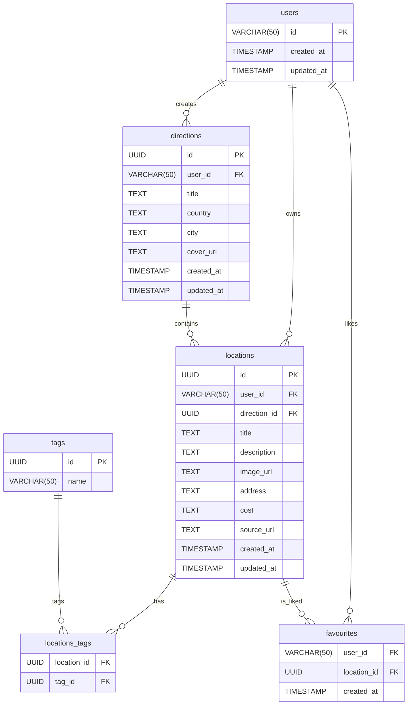

## Vision — «Ветки направлений» (Destination Branches)

---

### 1. Зачем это нужно

| Проблема сейчас                                                                                   | Что меняется                                                                                                                                                                            |
| ------------------------------------------------------------------------------------------------- | --------------------------------------------------------------------------------------------------------------------------------------------------------------------------------------- |
| Проект привязан к одному городу «Батуми»: все локации и фильтры жёстко заточены под одну поездку. | Пользователь сможет хранить **несколько самостоятельных направлений** (country / city / region). Каждое направление содержит собственный набор локаций, тегов, избранного и статистики. |
| Низкая повторная ценность: после поездки приложение становится бесполезным.                       | Приложение превращается в **универсальный планировщик путешествий**.                                                                                                                    |

---

### 2. Ключевые сценарии

1. **Просмотр хаба**
   Пользователь открывает `/` и видит сетку своих направлений (карточка: название, флаг страны, счётчик локаций).

2. **Создание направления**
   * Кнопка «➕ Добавить направление» открывает модалку.
   * Поля — *Название* (обяз.), *Страна/Город* (autocomplete), *Обложка* (обяз.).

3. **Навигация внутрь**
   Клик по карточке переходит на `/destination/{slug}` (или `/{country}/{city}`) — там отрисовывается **текущий LocationListPage** с фильтром `direction_id`.

   > Все существующие компоненты работают без изменений UI, меняются только запросы к БД, ведь теперь появилось направление.

5. **Редактирование / удаление направления**
   На карточке — меню «⋮» → «Переименовать», «Сменить обложку», «Удалить» (каскадно удаляет связанные локации, доступно только для автора).

---

### 3. UX-каркас новой главной

```
RootLayout
└─ /  (DestinationHubPage)
   ├─ Header  (прежний, но logo → "/")
   ├─ destinationGrid
   │    ├─ DestinationCard × N
   │    └─ AddDestinationButton  (floating FAB)
   └─ DestinationModal  (create / edit)
```

---

### 4. Модель данных (Supabase)



* **RLS**
	Не используется в этом проекте. Отключён
* Индекс
	Индекс `locations(direction_id, created_at)`

* **RPC**
```sql
-- 1. Добавление направления
CREATE OR REPLACE FUNCTION public.add_direction(
  p_user_id    TEXT,
  p_title      TEXT,
  p_country    TEXT,
  p_city       TEXT    DEFAULT NULL,
  p_cover_url  TEXT    DEFAULT NULL
)
RETURNS directions
LANGUAGE plpgsql
SECURITY DEFINER
AS $$
BEGIN
  RETURN QUERY
  INSERT INTO directions (user_id, title, country, city, cover_url, created_at, updated_at)
  VALUES (p_user_id, p_title, p_country, p_city, p_cover_url, now(), now())
  RETURNING *;
END;
$$;
-- 2. Обновление направления
CREATE OR REPLACE FUNCTION public.update_direction(
  p_user_id      TEXT,
  p_direction_id UUID,
  p_title        TEXT    DEFAULT NULL,
  p_country      TEXT    DEFAULT NULL,
  p_city         TEXT    DEFAULT NULL,
  p_cover_url    TEXT    DEFAULT NULL
)
RETURNS directions
LANGUAGE plpgsql
SECURITY DEFINER
AS $$
BEGIN
  RETURN QUERY
  UPDATE directions
  SET
    title      = COALESCE(p_title, title),
    country    = COALESCE(p_country, country),
    city       = COALESCE(p_city, city),
    cover_url  = COALESCE(p_cover_url, cover_url),
    updated_at = now()
  WHERE id = p_direction_id
    AND user_id = p_user_id
  RETURNING *;
END;
$$;
-- 3. Каскадное удаление направления вместе с локациями
CREATE OR REPLACE FUNCTION public.delete_direction(
  p_user_id      TEXT,
  p_direction_id UUID
)
RETURNS VOID
LANGUAGE plpgsql
SECURITY DEFINER
AS $$
BEGIN
  -- Сначала удаляем все локации в этой ветке
  DELETE FROM locations
  WHERE direction_id = p_direction_id
    AND user_id = p_user_id;

  -- Затем само направление
  DELETE FROM directions
  WHERE id = p_direction_id
    AND user_id = p_user_id;
END;
$$;
```
---

### 5. API & хуки

| Новое                            | Описание                                                                     |
| -------------------------------- | ---------------------------------------------------------------------------- |
| `useDirections()`                | `useQuery(['directions'], ...)` — список направлений пользователя.           |
| `useAddDirection()`              | Мутация создания; загружает обложку в Storage.                               |
| `useUpdateDirection()`           | Переименовать / сменить обложку.                                             |
| `useDeleteDirection()`           | Каскадное удаление.                                                          |
| **Модификация** `useLocations()` | принимает `activeDirectionId`; в запрос добавляет `.eq('direction_id', id)`. |

---

### 6. Роутинг

| Путь                                   | Компонент              | Комментарий                                |
| -------------------------------------- | ---------------------- | ------------------------------------------ |
| `/`                                    | **DestinationHubPage** | Хаб направлений                            |
| `/destination/[dirId]`                | **LocationListPage**   | Legacy-страница, но с пропом `directionId` |
| `/destination/[dirId]/locations/new`  | **AddLocationPage**    | …                                          |
| `/destination/[dirId]/locations/[id]` | **LocationDetailPage** | …                                          |

> Для удобных ссылок нужно генерировать человекочитаемый `slug` (`/italy/rome`).

---

### 7. Глобальное состояние (Zustand)

```ts
activeDirection: string|null,
setActiveDirection(id)
```

*При переходе на `/destination/[id]` хук роутера вызывает `setActiveDirection(id)`; при выходе в «хаб» — `null`.*

---

### 9. Риски и контр-меры

| Риск                                                      | Митигировать                                               |
| --------------------------------------------------------- | ---------------------------------------------------------- |
| Удаление направления стирает связанные локации необратимо | Подтверждение с перечислением кол-ва локаций.              |
| Рост числа запросов из-за фильтра `direction_id`          | Индекс `locations(direction_id, created_at)`               |
| Расхождение старых ссылок (`/locations/[id]`)             | 301 redirect на `/destination/{dir}/locations/[id]` через middleware |

---

### 10. Глоссарий

| Термин                      | Значение                                                                           |
| --------------------------- | ---------------------------------------------------------------------------------- |
| **Direction / Направление** | Логическая ветка проекта (страна / город), содержащая собственный каталог локаций. |
| **Hub**                     | Главная страница со списком направлений.                                           |
| **Branching**               | Механизм разделения данных по `direction_id`.                                      |

