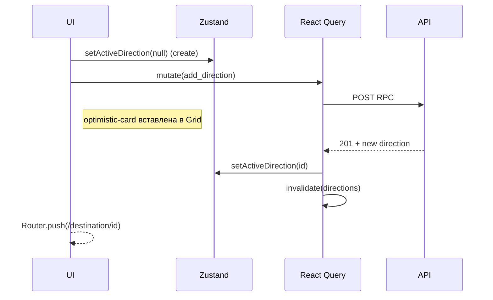

# StateManagement-NewMainPage

> **Модуль**: *Destination Branches*
> **Слой**: Клиентское состояние (React Query + Zustand + Context API)

---
## 1. Общая стратегия
| Задача                                 | Инструмент                         | Обоснование                                                                             |
| -------------------------------------- | ---------------------------------- | --------------------------------------------------------------------------------------- |
| Запросы / кеш / параллелизм            | **React Query**                    | Декларативный контракт, автоматическое кеширование, background-revalidate, retry logic. |
| UI-флаги, фильтры, модалки             | **Zustand** (persist + partialize) | Минимальный boilerplate, простой JIT-select, интеграция с optimistic patching.          |
| Темизация, сессия, QueryClientProvider | **Context API**                    | «Тяжёлые» провайдеры живут один раз в `RootLayout` (см. `Providers.js`).                |
| Межстраничная синхронизация кеша       | React Query Devtools (only dev)    | Трассировка key-инвалидаций при E2E.                                                    |

> **TL;DR:** *Данные с сервера* → React Query; *локальный UI* → Zustand; *глобальный side-effect (тема, сессия)* → Context.

---
## 2. React Query

### 2.1. Ключи
```ts
// query-keys.ts
export const qk = {
  directions: () => ["directions"],
  locations: (dirId: string|null, search: string, tags: string[]) => [
    "locations",
    { dir: dirId ?? "__root__", search, tags },
  ],
  location: (id: string) => ["location", id],
  tags: () => ["tags"],
  favourites: (userId: string) => ["favourites", userId],
};
```

* `directions` ― плоский список веток текущего пользователя.
* `locations` ― пагинированный infinite list; включает `direction_id` в ключе (из Zustand → `activeDirectionId`).

### 2.2. Параметры `QueryClient`
```ts
staleTime: 60_000,   // 1 минута (hub быстро реагирует на добавление/удаление)
gcTime:   30*60_000, // 30 минут
retry: 1,
refetchOnWindowFocus: false,
networkMode: "always",
```

Дополнительный `mutationCache.onError` глобально показывает toast и делает `rollback()` если контекст вернул `onMutate`.

### 2.3. Оптимистичные мутации (паттерн)
```ts
onMutate: async (input) => {
  await queryClient.cancelQueries(qk.directions());
  const prev = queryClient.getQueryData<Direction[]>(qk.directions());
  queryClient.setQueryData(qk.directions(), (old) => [
    { id: tempId, ...input, created_at: new Date().toISOString() },
    ...(old ?? []),
  ]);
  return { prev };
},
```

* **Rollback** выполняется в `onError` через `context.prev`.
* `invalidateQueries` всегда после **успешной** мутации.

### 2.4. Префетч
* На `DestinationHubPage` вызываем `queryClient.prefetchQuery(qk.directions())` внутри `useDirectionsPrefetcher`.
* При `hover` на `DestinationCard` (Desktop) запускаем `prefetchInfiniteQuery` по выбранной ветке.

### 2.5. Realtime sync
`FavouriteFetcher` и `LocationList` уже подписаны на `supabase.channel("realtime:locations-changes")`. Подписка расширяется фильтром `direction_id`, получая его из состояния при (ре)подписке.

---
## 3. Zustand

### 3.1. Расширенная схема `uiStore`
```ts
interface UIStore {
  activeDirectionId: string|null;
  setActiveDirection: (id:string|null)=>void;
  // существующие …
  searchQuery: string;
  selectedTags: string[];
  showLoginModal: boolean;
  showOnlyFavourites: boolean;
  favourites: Record<string, boolean>;
  /* Новое */
  directionFormDraft?: Partial<Direction>; // кеш черновика Modal
  setDirectionDraft: (p: Partial<Direction>|null) => void;
}
```
* `activeDirectionId` — **не** сохраняется в localStorage (`partialize`).
* `directionFormDraft` – временный кеш при редактировании модалки; очищается по `onSuccess`.

### 3.2. Persist-middleware
```ts
partialize: (s) => ({ favourites: s.favourites }),
version: 2, // bump после добавления веток
```

Миграция прошлого LS выполняется автоматически (ключи, которых нет, — игнорируются).

---

## 4. Context API
| Context                                  | Расположение                                                                    | Значение                           |
| ---------------------------------------- | ------------------------------------------------------------------------------- | ---------------------------------- |
| **ThemeContext**                         | `ThemeProvider`                                                                 | Тема UI, переключается в Settings. |
| **AuthContext**                          | `useSession()` (NextAuth)                                                       | Пользователь / jwt.                |
| **DirectionContext** (новый, очевидный?) | *не нужен*: id ветки уже есть в Zustand; дублировать в Context нецелесообразно. |                                    |

> **Решение**: единый источник `activeDirectionId` — Zustand; компоненты получают `const dir = useUIStore(s=>s.activeDirectionId)`.

---
## 5. Потоки обновления

### 5.1. CRUD Direction

* «Сдвиг» бесконечного списка локаций обрабатывается `queryKey` → кэш становится независимым от предыдущей ветки.

### 5.2. Удаление ветки
* Мутируется `delete_direction`.
* `onMutate` убирает карточку; при rollback — возвращает.
* После `onSuccess` дополнительно `queryClient.removeQueries(qk.locations(dirId,...))` для экономии памяти.

---
## 6. Кеширование изображений
* Путь `cover_url` каждой ветки хранится в Supabase Storage; URL отдаётся браузеру напрямую.
* Браузерное кеширование контролируется query-string хеша. При замене обложки RPC `update_direction` перезаписывает файл и возвращает **новый** `cover_url` с суффиксом `?v=<ts>`.

---
## 7. Конкурентность и гонки
1. **Параллельное добавление направлений:** key-collision устранена сортировкой `created_at DESC`; optimistic obj имеет `temp-id`<br>→ серверный ответ заменяет по идентификатору.
2. **Одновременный скролл разных веток:** React Query автоматически изолирует по ключу `dirId`.
3. **Смена ветки при активном `fetchNextPage`:**

   * `useEffect` в `LocationList` отменяет refetch при изменении `activeDirectionId` (cleanup `observer.disconnect()`).

---
## 8. Интеграционные шаги
1. **Бамп версии `uiStore`** → очистить старый LS, сохранить только `favourites`.
2. **Создать файл `query-keys.ts`.** Обновить все хуки.
3. **Расширить hook `useLocations`**: получать `dirId` аргументом (уже сделано).
4. **Написать новые CRUD-хуки для направлений** (см. `HookTemplate`): `useDirections`, `useAddDirection`, `useUpdateDirection`, `useDeleteDirection`.
5. **Внедрить `DestinationHubPage`** → префетчить `directions` и `tags`.
6. **E2E tests**: Cypress сценарий «создать + удалить направление» валидирует optimistic UI.

---
## 9. Расширение в будущем
* **Срез offline-first** — `sync-storage` плагин для React Query.
* **Server Actions (Next 14)** — заменить часть RPC на `action`s + `cache()`.
* **Оркестрация c concurrent mode** — при включении React 18 `useTransition` для smooth route-change.

---